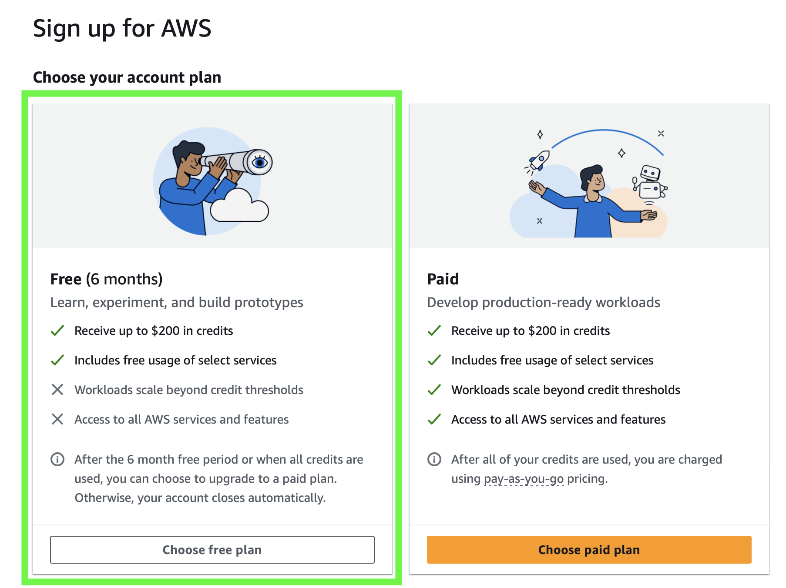

# AWS Free Tier

- [AWS Free Tier](#aws-free-tier)
    - [Sikkerhetstiltak og kostnadsovervåkning](#sikkerhetstiltak-og-kostnadsovervåkning)
        - [Multi-Factor Authentication (MFA)](#multi-factor-authentication-mfa)
        - [Zero Spend Budget - Oppsett for å avdekke eventuelle tjenester som har en kostnad](#zero-spend-budget---oppsett-for-å-avdekke-eventuelle-tjenester-som-har-en-kostnad)
        - [AWS Free Tier-varsler](#aws-free-tier-varsler)
        - [Bruk AWS Resource Explorer](#bruk-aws-resource-explorer)
            - [Hvordan bruke AWS Resource Explorer](#hvordan-bruke-aws-resource-explorer)
    - [Hvordan vet jeg hvor mye jeg har igjen av free tier kvoten min?](#hvordan-vet-jeg-hvor-mye-jeg-har-igjen-av-free-tier-kvoten-min)

I ukesoppgavene i dette kurset vil vi kun benytte tjenester som faller innenfor rammene av [AWS Free Tier](https://aws.amazon.com/free/). Dersom du bruker tjenester som er uten free tier, kan dette medføre kostnader for deg. I ukesoppgavene og gjennom kurset vil vi utelukkende bruke tjenester innenfor AWS Free Tier. Du kan lese mer om free tier [her](https://docs.aws.amazon.com/awsaccountbilling/latest/aboutv2/free-tier.html).

> [!CAUTION]
> **Enhver kostnad som påløper er brukerens eget ansvar. Gokstad Akademiet fraskriver seg ethvert ansvar for kostnader som kan oppstå som følge av bruk eller eksperimentering med AWS-tjenester utenfor free tier. Vær derfor meget varsom når du eksperimenterer med nye tjenester, og vær sikker på at de er innenfor free tier, eller til en pris du er villig til å betale. Ved opprettelse av konto har en mulighet til å selecte planen som heter "Free (6 months)", og en vil da være sikker på at det ikke kan opprettes ressurser som pådrar kostnader. Sørg også for å velge support planen som er gratis. Se bilde under.**

## Sikkerhetstiltak og overvåkning

Nedenfor finner du tiltak som kan hjelpe med å sikre kontoen din og overvåke bruken av AWS Free Tier. For å beskytte kontoen din og holde oversikt over ressursbruken, anbefaler vi at du setter opp følgende:

### Multi-Factor Authentication (MFA)

Det er sterkt anbefalt å aktivere MFA på din AWS root-konto og alle IAM-brukere for økt sikkerhet:

1. Logg inn på AWS Management Console
2. Gå til IAM-dashbordet
3. Under "Security recommendations"
4. Under "Add MFA for root user", klikk "Add MFA"
5. Gi MFA-enheten ett navn
6. Velg hva du ønsker under "Device options". For de fleste vil nok "Authenticator App" være det beste. 
7. Scan QR-koden som 
5. Velg type MFA-enhet (vanligvis "Virtual MFA device")
6. Bruk en autentikator-app (som Google Authenticator) til å skanne QR-koden
7. Skriv inn to påfølgende MFA-koder for å bekrefte oppsettet

<!-- ### Zero Spend Budget - Oppsett for å avdekke eventuelle tjenester som har en kostnad

1. Logg inn på AWS Management Console.
2. Gå til "Billing and Cost Management" dashboardet.
3. Velg "Budgets" fra menyen på venstre side.
4. Klikk på "Create budget".
5. Velg "Use a template", velg "Zero spend budget"
6. Gi budsjettet et navn, for eksempel "Zero Spend Budget".
8. Konfigurer varsler slik at du mottar en e-post hvis kostnadene overstiger 0 NOK. Sett gjerne denne til den eposten du sjekker oftest. 
9. Klikk "Create" for å opprette budsjettet.

### AWS Free Tier-varsler

1. Logg inn på AWS Management Console og åpne Billing-konsollen på https://console.aws.amazon.com/billing/.
2. Under "Preferences" i navigasjonsruten, velg "Billing preferences".
3. For "Alert preferences", velg "Edit".
4. Velg "Receive AWS Free Tier alerts" for å melde deg på Free Tier-varsler. 
5. Velg "Update".

### Bruk AWS Resource Explorer

AWS Resource Explorer er et verktøy som lar deg søke etter og finne AWS-ressurser i kontoen din. Dette kan være spesielt nyttig for å avdekke ressurser som du kanskje har glemt å slette etter en workshop eller eksperimentering. Ved opprettelse av VPC huker du av for at alle ressurser i VPCet skal tagges, se bilde:

#### Hvordan bruke AWS Resource Explorer

1. Logg inn på AWS Management Console.
2. Gå til "Resource Explorer" fra tjenestemenyen.
3. Gjelder kun første gang du er innom Resource Explorer: Trykk på `Turn on Resource Explorer` -> `Quick Setup`
4. Bruk søkefeltet til å søke etter dinne taggede ressurser ved å sette "Query Template" til "Tagged resources", eller til å søke på andre spesifikke ressurser, for eksempel EC2-instanser, S3-bøtter, eller RDS-databaser.
5. Filtrer resultatene etter region, ressurs-type, eller andre kriterier for å få en bedre oversikt.
6. Gå gjennom listen over ressurser og identifiser de som ikke lenger er nødvendige.
7. Slett eller stopp ressurser som ikke er i bruk for å unngå unødvendige kostnader.

Ved å regelmessig bruke AWS Resource Explorer kan du bli mer sikker på at du ikke har ubrukte ressurser som påløper kostnader, og dermed holde deg innenfor AWS Free Tier-grensene.

## Hvordan vet jeg hvor mye jeg har igjen av free tier kvoten min?

Det er mulig å sjekke hvor du har brukt av din free tier kvote ved å gå til `Billing and Cost Management` på kontoinnstillinger (knappen øverst i høyre hjørne i AWS konsollet):

Videre herfra trykker du på `Free Tier` i menyen til venstre og får opp følgende view:

 -->